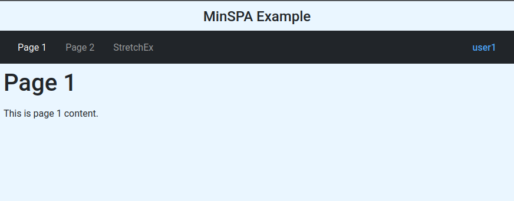

# Minspa Navbar

A lightweight UI navigation bar service with bootstrap like styling.  This is a standalone component of the Minspa framework, and can be used independently, or with the framework.

**[Minspa](https://github.com/devosm1030/minspa)** is a modern lightweight UI SPA framework.

- Modular - Written as ES modules, supported by all modern browsers.
- Depencency free - No nested dependencies.
- Vanilla - Components can be cloned and used as-is, directly within your project without the need for bundling.

## Table of Contents

- [Overview](#overview)
- [Installation and Usage](#installation-and-usage)
- [API Reference](#api-reference)
  - [`new Navbar(rootElem, navPages, userid?, styles?)`](#new-navbarrootelem-navpages-userid-styles)
  - [`navbar.onNavLinkClicked(callback)`](#navbaronnavlinkclickedcallback)
  - [`navbar.render()`](#navbarrender)
  - [`navbar.newPageDisplayed(path?)`](#navbarnewpagedisplayedpath)
  - [`navbar.hide()`](#navbarhide)
  - [`navbar.show()`](#navbarshow)
  - [`navbar.remove()`](#navbarremove)
- [Advanced Usage](#advanced-usage)
  - [Custom Styling](#custom-styling)
  - [Dynamic Page Management](#dynamic-page-management)
  - [Integration with Routers](#integration-with-routers)
- [Responsive Behavior](#responsive-behavior)
- [Browser Compatibility](#browser-compatibility)

## Overview

Navbar provides a responsive navigation bar component with Bootstrap-like styling that works seamlessly in modern web applications. It uses Shadow DOM for style encapsulation and supports mobile-responsive collapsible navigation.

### Key Features

- **Bootstrap-style appearance** - Familiar navigation bar styling without requiring Bootstrap dependency
- **Shadow DOM encapsulation** - Styles are isolated and won't conflict with your application's CSS
- **Responsive design** - Automatically adapts to mobile devices with collapsible menu
- **User display** - Optional user identification display in the navigation bar
- **Active state management** - Automatically highlights the current page
- **Customizable styling** - Override or extend default styles
- **Hide/show capability** - Conditionally display navbar based on route configuration

### Bootstrap Styling Note

- This component does not depend on Bootstrap - it includes a hardcoded subset of Bootstrap like styles incuded under the Bootstrap MIT license, needed to give it the Bootstrap styled look without the Bootstrap dependency.
- The navbar is rendered in a Shadow DOM, to ensure no conflicts with any styles used in the main SPA project. The SPA project may choose to use Bootstrap styling in its entirety, or some completely different styling.
- Navbar styles may be overridden with custom styling if desired.

## Installation and Usage

### For NodeJS projects

#### Installation

In your project directory, install the dependency on the command line:

```bash
npm install --save @minspa/navbar
```

#### Usage

Import the package in your code:

```javascript
import { Navbar } from '@minspa/navbar'
```

### For Vanila projects

#### Vanilla Installation

Clone [MinspaNavbar.js](https://github.com/devosm1030/minspa/blob/main/packages/Navbar/MinspaNavbar.js) into your project.

#### Vanilla Usage

From an ES module, import the package in your code:

```javascript
import { Navbar } from '<path/to/>MinspaNavbar.js'
```

## Sample Screenshot



## API Reference

### `new Navbar(rootElem, navPages, userid?, styles?)`

Create a new Navbar instance.

**Parameters:**

- `rootElem` (HTMLElement, required) - The DOM element where the navbar will be rendered
- `navPages` (Array, required) - Array of page objects defining navigation items
  - Each page object should have:
    - `path` (string, required) - The route path for the page
    - `navName` (string, optional) - Display name in navbar. If omitted, page won't appear in navbar
    - `hideNavBar` (boolean, optional) - If true, navbar will be hidden when on this page
- `userid` (string, optional, default: `null`) - User identifier to display in navbar
- `styles` (object, optional) - Custom styling options
  - `stylesheet` (string, optional) - Complete replacement stylesheet
  - `additionalStyles` (string, optional) - CSS to append to default styles

**Returns:** Navbar instance

**Example:**

```javascript
const pages = [
  { path: '/', navName: 'Home' },
  { path: '/about', navName: 'About' },
  { path: '/contact', navName: 'Contact' },
  { path: '/admin', navName: 'Admin', hideNavBar: false },
  { path: '/login' } // No navName, won't appear in navbar
];

const navbar = new Navbar(
  document.getElementById('nav-container'),
  pages,
  'john.doe@example.com'
);
```

**With custom styles:**

```javascript
const customStyles = {
  additionalStyles: `
    .navbar {
      background-color: #1a1a2e !important;
    }
    .nav-link {
      color: #eee !important;
    }
  `
};

const navbar = new Navbar(
  document.getElementById('nav-container'),
  pages,
  'user@example.com',
  customStyles
);
```

---

### `navbar.onNavLinkClicked(callback)`

Register a callback function to handle navigation link clicks. This method must be called before `render()`.

**Parameters:**

- `callback` (function, required) - Function called when a navigation link is clicked. Receives the path of the clicked link as an argument.

**Returns:** Navbar instance (for chaining)

**Throws:** Error if not called before `render()`

**Example:**

```javascript
navbar.onNavLinkClicked((path) => {
  console.log('Navigating to:', path);
  // Handle navigation (e.g., update router, change content)
  router.navigate(path);
});
```

**Chainable pattern:**

```javascript
const navbar = new Navbar(rootElem, pages, userid)
  .onNavLinkClicked((path) => router.navigate(path))
  .render();
```

---

### `navbar.render()`

Render the navbar in the DOM. Must be called after `onNavLinkClicked()`.

**Parameters:** None

**Returns:** Navbar instance (for chaining)

**Throws:** Error if `onNavLinkClicked()` was not called first

**Behavior:**

- Creates Shadow DOM for style encapsulation
- Renders navbar HTML structure
- Attaches event listeners for navigation and mobile toggle
- Automatically shows active page state
- If navbar already exists, removes old instance before rendering new one

**Example:**

```javascript
navbar
  .onNavLinkClicked((path) => router.navigate(path))
  .render();
```

**Re-rendering:**

```javascript
// Update navbar configuration
navbar.navPages = updatedPages;
navbar.userid = 'newuser@example.com';

// Re-render (automatically removes old navbar first)
navbar.render();
```

---

### `navbar.newPageDisplayed(path?)`

Update the navbar to reflect the current page. Highlights the active navigation link and shows/hides the navbar based on page configuration.

**Parameters:**

- `path` (string, optional, default: current URL pathname) - The path of the newly displayed page

**Returns:** `undefined`

**Behavior:**

- Adds `active` class to the navigation link matching the path
- Removes `active` class from all other navigation links
- Hides navbar if page has `hideNavBar: true`
- Shows navbar otherwise
- Does nothing if navbar hasn't been rendered yet

**Example:**

```javascript
// Called automatically by render()
navbar.render();

// Manually update when route changes
router.on('routeChange', (newPath) => {
  navbar.newPageDisplayed(newPath);
});

// Use current URL if no path provided
navbar.newPageDisplayed(); // Uses window.location.href
```

---

### `navbar.hide()`

Hide the navbar from view.

**Parameters:** None

**Returns:** `undefined`

**Example:**

```javascript
// Hide navbar programmatically
navbar.hide();

// Show it again later
navbar.show();
```

---

### `navbar.show()`

Show the navbar if it was previously hidden.

**Parameters:** None

**Returns:** `undefined`

**Example:**

```javascript
// Show navbar
navbar.show();
```

---

### `navbar.remove()`

Remove the navbar from the DOM and clean up references.

**Parameters:** None

**Returns:** `undefined`

**Behavior:**

- Removes navbar element from DOM
- Clears internal references to navbar element and shadow root
- Event listeners are automatically cleaned up when element is removed

**Example:**

```javascript
// Clean up navbar when no longer needed
navbar.remove();

// Navbar can be re-rendered later if needed
navbar.render();
```

---

## Advanced Usage

### Custom Styling

**Complete stylesheet replacement:**

```javascript
const customStylesheet = `
  .navbar {
    background-color: #2c3e50;
    padding: 1rem;
  }
  .nav-link {
    color: #ecf0f1;
    font-weight: bold;
  }
  .nav-link:hover {
    color: #3498db;
  }
  .nav-link.active {
    color: #e74c3c !important;
  }
`;

const navbar = new Navbar(
  rootElem,
  pages,
  userid,
  { stylesheet: customStylesheet }
);
```

**Extending default styles:**

```javascript
const additionalStyles = `
  .navbar {
    border-bottom: 3px solid #ff6b6b;
  }
  .nav-link {
    text-transform: uppercase;
    letter-spacing: 1px;
  }
`;

const navbar = new Navbar(
  rootElem,
  pages,
  userid,
  { additionalStyles }
);
```

### Dynamic Page Management

**Updating navigation items:**

```javascript
const navbar = new Navbar(rootElem, initialPages, userid);
navbar.onNavLinkClicked(handleNav).render();

// Later, update pages dynamically
function updateNavigation(newPages) {
  navbar.navPages = newPages;
  navbar.render(); // Re-render with new pages
}

// Example: Add admin page after authentication
if (user.isAdmin) {
  const updatedPages = [
    ...navbar.navPages,
    { path: '/admin', navName: 'Admin' }
  ];
  updateNavigation(updatedPages);
}
```

### Integration with Routers

**Automatic Integration with Minspa Router:**

The Minspa Navbar and Router modules are designed to auto-integrate seamlessly. When both modules are used together, no manual wiring is required - simply instantiate them both, and they will connect automatically. The only requirement is that the router be instantiated before the navbar is rendered.

```javascript
import { Router } from '@minspa/router';
import { Navbar } from '@minspa/navbar';

const navBar = new Navbar(navRoot, pages)
new Router(rootElem, pages).initialNav()
navBar.render()
```

**Manual integration (if not using Minspa Router):**

If you're using a different router or custom navigation system, you can manually wire the integration:

```javascript
const navbar = new Navbar(navRoot, pages, userid);

// Handle navigation link clicks
navbar.onNavLinkClicked((path) => {
  // Your custom navigation logic
  customRouter.navigate(path);
});

// Update navbar when routes change
customRouter.on('routeChange', (newPath) => {
  navbar.newPageDisplayed(newPath);
});

navbar.render();
```

---

## Responsive Behavior

The navbar automatically adapts to different screen sizes:

**Desktop (> 768px):**

- Navigation links displayed horizontally
- Toggle button hidden
- All navigation visible by default

**Mobile (≤ 768px):**

- Hamburger toggle button appears
- Navigation collapses into vertical menu
- Click toggle to show/hide navigation items
- Touch-friendly tap targets

**Responsive features:**

- Breakpoint at 768px
- Smooth transitions
- Accessible toggle button
- Maintains functionality across all screen sizes

---

## License

MIT License - See notice in source code comments.
